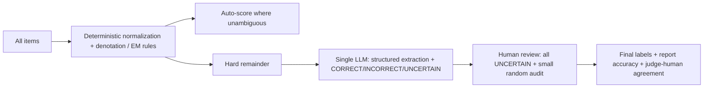
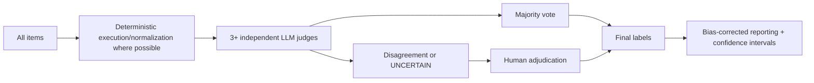

# State-of-the-Art Evaluation Methods for Table Question Answering with LLMs

[Download this report as a Markdown file](sandbox:/mnt/data/table_qa_llm_evaluation_report.md)

## Executive summary

Table question answering (Table QA) evaluation has become harder in the LLM era because many modern systems produce **free-form, multi-sentence answers** (sometimes with reasoning), while classic benchmarks assume **short denotations** (cell values, lists, booleans, or numbers). Traditional automatic metrics (exact match, token F1, BLEU/ROUGE) are inexpensive and reproducible but often **mis-score semantically correct paraphrases** or **over-score partially overlapping wrong answers**—a mismatch that becomes more frequent as answers get longer and more abstract. citeturn19view0turn13view0

Across current Table QA practice, three evaluation “families” dominate:

- **Deterministic scoring** (denotation accuracy / EM / F1) with rigorous normalization and, when available, **execution-based evaluation** (SQL or program execution). Classic table semantic parsing datasets and many modern tabular benchmarks still rely on these because they are cheap, auditable, and stable. citeturn8view0turn20view0turn14view0
- **LLM-assisted structured evaluation**, where an LLM converts free-form answers into **canonical structured forms** (e.g., JSON lists, numeric scalars with units), and the final score is computed deterministically (precision/recall/F1). Recent Table QA benchmarks explicitly adopt this “Text→JSON→metric” pattern to improve robustness against superficial phrasing differences and formatting drift. citeturn13view0turn14view0
- **LLM-as-judge** (answer-level entailment/correctness judging), used when gold answers are underspecified, outputs are long-form, or programmatic rules don’t cover edge cases. The research consensus is that LLM judges can be valuable but require **structured prompts**, **explicit rubrics**, **uncertainty/abstention options**, and **bias controls** (notably order randomization). citeturn6search0turn6search1turn11search2turn6search5

For budget-constrained evaluation (dataset size and budget unspecified), the most defensible approach in 2026 is a **hybrid pipeline**: deterministic parsing/normalization first, LLM judging only for the “hard remainder,” and **human auditing of a targeted subset** (all uncertain cases + a random sample of confident auto/LLM decisions). This matches both (a) modern Table QA benchmark workflows and (b) statistical work showing that naive LLM-judge scores can be biased unless calibrated/adjusted using human-labeled calibration data. citeturn13view0turn11search7

Many primary papers and benchmark PDFs referenced below are hosted via the entity["organization","Association for Computational Linguistics","professional society"] Anthology (ACL Anthology) or as peer-reviewed preprints; URLs are included inline in code formatting for easy reuse.

## Table QA evaluation landscape

Table QA spans multiple task configurations: a table may be given directly, retrieved from a corpus, or paired with additional context (linked passages, reports, images). Answer formats range from **short denotations** (a cell value, a list, a boolean, a number) to **free-form natural-language explanations** that integrate multiple table facts. A recent LLM-era survey organizes Table QA by table format, context, question complexity, and answer format, underscoring that evaluation must track these differences. citeturn15view0

Evaluation difficulties concentrate in a few recurring patterns:

- **Many surface forms can be correct** (paraphrase, aliases, abbreviations, punctuation, units, numeric formatting).
- **Set-valued answers** (multiple correct items; order-insensitive) and partial credit for missing/extra items.
- Correctness depends on **table operations** (filtering, joins, aggregation, arithmetic) and not just lexical overlap.
- Outputs include **rationales**, where “good explanation” is separable from “correct denotation.” citeturn19view0turn21view0turn13view0

A practical evaluation design choice is what you treat as the scored output:

- **Answer-only scoring:** does the final answer match the gold denotation/text span?
- **Answer + evidence scoring:** did the system cite/select the correct cells/rows/spans (supports auditing and robustness tests)?
- **Process/program scoring:** did the system produce the correct executable query/program, not merely the right final denotation? citeturn8view0turn2view1turn14view0

## Automated metrics and deterministic scoring

### Exact match and token-level F1

**Description.** Exact match (EM) returns 1 if the prediction equals a gold answer after preprocessing; token-level F1 measures overlap between the prediction’s and gold’s token sets. Table QA inherits EM/F1 particularly when answers are short spans extracted from tables or linked passages.

**Typical use cases.** Multi-hop or hybrid-table QA benchmarks that treat answers as text spans; HybridQA reports EM and F1. (HybridQA: `https://ar5iv.org/pdf/2004.07347`.) citeturn5view0

**Strengths.** Very cheap; easy to reproduce; deterministic; can be computed at scale.

**Weaknesses.** Brittle to paraphrase and formatting. Token-level F1 can assign **non-zero** scores to incorrect answers if they overlap lexically with the gold; systematic QA metric studies highlight this mismatch between n-gram overlap and human correctness. citeturn19view0turn14view0

**Cost/compute implications.** Near-zero incremental cost; trivial to run for millions of examples.

**Recommended best practices.**  
Use typed normalization for numbers/dates; treat list answers as sets unless order matters; report separate “format error” rates if answers must follow a constrained schema. citeturn14view0turn8view0

### Denotation accuracy and typed set matching

**Description.** Many table semantic parsing benchmarks rely on **denotation accuracy**: whether the predicted answer denotation (often a **set/list of values**) equals the gold denotation after type-aware normalization.

The official WikiTableQuestions evaluator defines three value types (string/number/date), provides a detailed string normalizer (diacritics, quotes/dashes, citations, parentheses, punctuation, case/whitespace), and considers a prediction correct iff the predicted and target denotations have equal size and can be matched item-by-item under typed equality. (WTQ paper: `https://arxiv.org/pdf/1508.00305`; evaluator: `https://github.com/ppasupat/WikiTableQuestions/blob/master/evaluator.py`.) citeturn8view0turn2view3

**Typical use cases.** WikiTableQuestions and related Table QA papers; TAPEX states that Table QA benchmarks use denotation accuracy (predicted answers equal ground-truth answers). (TAPEX: `https://arxiv.org/pdf/2107.07653`.) citeturn20view0

**Strengths.** Strong fit to “table lookup + compositional operations” tasks when answers are truly denotations; deterministic and highly auditable.

**Weaknesses.** Still brittle beyond the normalization rules (synonyms/aliases not covered, implicit units); sensitive to evaluation-script and annotation noise. TAPEX reports that on WikiSQL-WEAK, “nearly 2%” of answers from the official evaluation script are incorrect and uses alternative answer annotations. citeturn20view0

**Cost/compute implications.** Low compute, but nontrivial engineering to implement and maintain correct typed normalization (especially for dates and heterogeneous table strings).

**Recommended best practices.**  
Adopt the official evaluator whenever available; add regression tests from real error cases; record evaluator version and any deviations from the canonical script. citeturn8view0turn20view0

### N-gram metrics for free-form answers (BLEU, ROUGE, METEOR, sacreBLEU)

**Description.** N-gram similarity metrics compare generated text to a reference via n-gram overlap (BLEU), recall-oriented overlap (ROUGE variants), or alignment heuristics with stemming/synonyms (METEOR). Primary sources: BLEU (`https://aclanthology.org/P02-1040.pdf`), ROUGE (`https://aclanthology.org/W04-1013.pdf`), METEOR (`https://aclanthology.org/W05-0909/`), and BLEU reporting standardization (sacreBLEU motivation: `https://arxiv.org/abs/1804.08771`). citeturn17search0turn17search1turn17search2turn17search3

**Typical use cases.** Free-form Table QA datasets with paragraph-like answers. FeTaQA reports sacreBLEU, ROUGE-{1,2,L}, and METEOR, alongside human evaluation. (FeTaQA: `https://aclanthology.org/2022.tacl-1.3.pdf`.) citeturn6search3

**Strengths.** Cheap; standardized implementations; supports long-form outputs; easy to compare across systems when reporting is consistent. citeturn17search3turn6search3

**Weaknesses.** Weak sensitivity to factual correctness in QA; may heavily penalize correct paraphrases and fail on context-dependent equivalence. Systematic QA metric work documents cases where ROUGE/METEOR assign 0 despite humans judging answers fully correct. citeturn19view0turn6search3

**Cost/compute implications.** Low.

**Recommended best practices.**  
Treat BLEU/ROUGE/METEOR as **secondary** metrics for Table QA unless the task is explicitly text generation; pair them with correctness-oriented evaluation (denotation, execution, evidence scoring, or LLM-assisted structuring) and specify the exact metric implementation details. citeturn17search3turn13view0

### Cell-level, evidence-level, and aggregation-level scoring

**Cell-level scoring (answers as cell coordinates).** SQA restricts questions to those answerable by table cells and records answer coordinates “as opposed to answer text,” explicitly to remove normalization issues; it reports overall accuracy and sequence accuracy (all questions in a sequence correct). (SQA: `https://aclanthology.org/P17-1167.pdf`.) citeturn9view0turn10view0

- **Strengths:** high auditability; avoids string matching ambiguity; supports fine-grained error analysis.
- **Weaknesses:** requires special annotation; under-specifies cases with multiple equivalent cell sets (duplicate values).

**Evidence-level scoring (supporting cells/spans).** When datasets provide supporting cells/spans, you can score the evidence set with precision/recall/F1. TableEval’s evaluation method explicitly computes precision/recall/F1 over structured reference answers and model outputs (after structured extraction), illustrating how set F1 can be operationalized for table answers. (TableEval: `https://aclanthology.org/2025.emnlp-main.363.pdf`.) citeturn13view0

**Aggregation-level scoring (operator + arguments).** For aggregation questions you can score operator correctness, argument correctness, and final denotation correctness. TAPAS motivates this by predicting denotations via cell selection and **optional** aggregation operator application. (TAPAS: `https://aclanthology.org/2020.acl-main.398/`.) citeturn3view2

**Cost/compute implications.** Evidence and aggregation scoring raise annotation and engineering cost but improve auditability and robustness testing.

**Recommended best practices.**  
If you can afford richer annotations, prioritize evidence/operator labels for reasoning-heavy datasets; if not, approximate evidence evaluation via stable heuristics (cell linking) and treat it as diagnostic rather than a headline score. citeturn21view0

## Programmatic normalization and execution-based evaluation

Programmatic normalization aims to turn many superficially different but semantically equivalent answers into a shared canonical form so that *final scoring* can remain deterministic.

### Table-aware canonicalization primitives

The WikiTableQuestions evaluator is a canonical example of “table-aware string + type normalization.” Its normalization pipeline includes diacritic removal, quote/dash normalization, stripping citation markers and trailing parentheticals, lowercasing, and whitespace collapsing; it also defines typed matching for numbers and partial dates. citeturn8view0

A practical Table QA canonicalization toolkit typically implements a superset of these primitives:

- **String canonicalization:** Unicode normalization; punctuation trimming; alias maps (e.g., “U.S.” → “US”); table-citation stripping where applicable.
- **List/set canonicalization:** robust splitting; order-insensitive matching; duplicate handling.
- **Date canonicalization:** normalize formats (YYYY-MM-DD), with explicit semantics for partial dates (year-only, month-year).
- **Number canonicalization:** thousands separators; scientific notation; percentages; sign; and (if specified) rounding precision.

**Strengths.** Deterministic; transparent; low marginal cost; amenable to unit tests.

**Weaknesses.** Engineers must decide what equivalences are safe; aliasing and unit conversions can become domain-specific and brittle if not documented.

**Best practices.** Embed canonicalization in a versioned library; add a “needs_judge” escape hatch for ambiguous cases rather than silently forcing equivalence.

### Numeric, unit, and scale normalization

Numeric answers in Table QA frequently appear with implicit or explicit units (currency, percent, “million/billion,” time periods). Numeric reasoning benchmarks often move beyond raw string match:

- FinQA evaluates via **execution accuracy** (running a reasoning program to obtain the final answer) and **program accuracy** (matching the predicted program), and reports high expert agreement; it also shows non-expert crowdworkers can be far less reliable. (FinQA: `https://aclanthology.org/2021.emnlp-main.300.pdf`.) citeturn2view1
- TAT-QA emphasizes numeric reasoning over tabular + textual content and reports F1 and expert-human performance. (TAT-QA: `https://aclanthology.org/2021.acl-long.254/`.) citeturn22view0

**Recommended best practices (numeric).**
- Normalize numeric strings and (where possible) units/scales.
- Use *precision-aware tolerances* when tasks specify rounding; otherwise pre-register absolute/relative tolerance rules and document them.
- For benchmarks with gold derivations/programs, prefer execution-based evaluation, and separately report denotation accuracy vs program accuracy. citeturn2view1turn22view0

**Rounding and tolerance (how to choose and report it).**  
If the benchmark defines rounding/scale, follow it exactly and report it alongside the metric. If it does not, pre-register a tolerance rule tied to the *implied precision* of the gold answer (for example: if the reference is printed with 2 decimal places, compare after rounding both values to 2 decimals; if the reference is an integer, allow only tiny floating-point noise).

A useful concrete reference point is the WikiTableQuestions evaluator: it casts numbers to integers when `abs(amount - round(amount)) < 1e-6`, which effectively treats near-integers as the same integer denotation. citeturn8view0

When you publish results, report the tolerance rule in plain language (absolute vs relative, or “round-to-d decimals”), and include counts of borderline cases (e.g., how many predictions were accepted only under tolerance). This improves auditability and reduces the risk of “silent” metric inflation.

### SQL/logic execution and program-based scoring

When a system outputs a formal query (SQL or a logical form) rather than a plain answer, **execution-based evaluation** compares the executed denotation to the gold denotation. This mitigates the fact that many different queries can be semantically equivalent.

Text-to-SQL benchmarks provide mature evaluation tooling: the Spider project evaluates structured predictions via component-based matching and also offers execution-based metrics; its repository documents evaluation choices and changes in official metrics over time. (Spider: `https://yale-lily.github.io/spider` and official repo: `https://github.com/taoyds/spider`.) citeturn7search1turn7search5turn7search17

Table QA model papers highlight a practical caveat: official scripts can contain errors. TAPEX notes that for WikiSQL-WEAK nearly 2% of answers from the official evaluator are incorrect, so it evaluates using alternative answer annotations. citeturn20view0

**Strengths.** Often a better proxy for semantic correctness than string-level program match; supports verifiable evaluation when the execution environment is stable.

**Weaknesses.** Spurious programs can “accidentally” execute to the right answer; handling NULLs/empties can be inconsistent across engines; floating-point arithmetic can introduce tolerance issues.

**Best practices.** Prefer execution accuracy as the primary metric, but track spuriousness via program constraints or test suites; log execution failures; pin database versions and evaluation scripts. citeturn7search5turn20view0

### A concrete normalization rule sketch

Below is a conservative rule set for answer canonicalization. It normalizes what you can justify deterministically and routes ambiguous cases to a judge/human.

```python
# Pseudocode: canonicalize a Table QA answer into a typed structure.
def canonicalize_answer(raw, table=None):
    s = unicode_normalize(raw)
    s = strip_citations_parentheticals(s)
    s = normalize_quotes_dashes(s)
    s = strip_trailing_punct(s)
    s = collapse_whitespace_lower(s)

    # Try typed parses
    if looks_like_date(s):
        return {"type": "date", "value": parse_partial_date(s)}  # explicit unknown fields
    if looks_like_number_or_percent(s):
        return {"type": "number", "value": parse_number(s), "unit": parse_unit_if_any(s)}

    # List handling (commas, bullets, conjunctions)
    if looks_like_list(s):
        items = split_list_items(s)
        items = [canonicalize_answer(x, table) for x in items]
        return {"type": "set", "value": dedupe_order_insensitive(items)}

    # Optional: table-aware linking (map to closest cell value after normalization)
    if table is not None:
        linked = try_link_to_cell(s, table, fuzzy=True)
        if linked.confidence >= 0.9:
            return {"type": "cell_string", "value": linked.cell_text_normalized}

    return {"type": "string", "value": s}
```

This aligns with the typed normalization logic and explicit denotation matching used in official evaluators like WikiTableQuestions. citeturn8view0

## LLM-as-judge evaluation for Table QA

LLM-as-judge evaluation is used when outputs are open-ended, gold answers are not fully canonicalized, or deterministic rules fail to cover edge cases. Table QA makes judging especially subtle because answers can be **set-valued**, include **implicit units**, or depend on table context (so judging cannot be done from answer strings alone). Recent overviews of LLM judges emphasize methodology and limitations. (Survey: `https://arxiv.org/abs/2412.05579`.) citeturn6search9

Where organizations matter operationally, many evaluations use proprietary API judges (e.g., GPT-family models from entity["company","OpenAI","ai company"] or Claude-family models from entity["company","Anthropic","ai company"]), but the methodological controls below apply to open and closed judges alike.

### Single-judge vs panel-judge designs

**Single judge.** One capable LLM returns CORRECT/INCORRECT/UNCERTAIN. This is simplest but can suffer from judge idiosyncrasies and bias.

**Panel of judges.** PoLL (“panel of diverse models”) finds that aggregating judgments from multiple diverse model families can outperform a single large judge, reduce intra-model bias, and be substantially cheaper in some settings. (PoLL: `https://arxiv.org/abs/2404.18796`.) citeturn6search1

**Cost/compute implications.** Panel judging increases API calls, but PoLL-style designs can trade *many small judges* for *one very large judge*, sometimes improving both cost and robustness. citeturn6search1

**Best practices.**
- Enforce independence: no judge sees another judge’s verdict; keep separate runs/chats.
- Blind the judge to which system produced the answer (reduces self-enhancement and reputation bias).
- Pre-register aggregation rules (majority vote, tie-break escalation to human). citeturn11search2turn6search1

### Prompting and structured outputs

G-Eval popularized “form-filling” evaluation prompts with explicit criteria and structured outputs to improve alignment with human judgments in NLG evaluation. The transferable Table QA lesson is: specify a rubric and force a consistent output schema (especially for set-valued and numeric answers). (G-Eval: `https://aclanthology.org/2023.emnlp-main.153.pdf`.) citeturn6search0turn6search16

TableEval’s SEAT method is a Table QA–specific instantiation: an LLM is prompted to extract structured answers from model outputs and structured references, label per-element correctness, and then the benchmark computes precision/recall/F1 deterministically from the structured record. citeturn13view0

### Uncertainty labels, abstention, and calibration

For Table QA, “UNCERTAIN” is necessary because equivalence can be genuinely ambiguous (implicit units, multiple valid denotations, or underspecified reference answers). Recent research provides three complementary directions:

- **Uncertainty quantification for LLM judges**, including interval-based/statistical perspectives. (Example: `https://aclanthology.org/2025.emnlp-main.569.pdf`.) citeturn11search1
- **Selective/abstaining judging**, where the judge abstains when confidence is low rather than forcing a verdict. (Example: `https://arxiv.org/html/2602.13110v1`.) citeturn11search5
- **Bias-corrected reporting**, where judge sensitivity/specificity are estimated on a human-labeled calibration set to correct naive judge-derived accuracy and to build confidence intervals. (Reporting framework: `https://arxiv.org/abs/2511.21140`.) citeturn11search7turn11search4

### Known judge biases and robustness controls

LLM judges can exhibit **position bias** (favoring answers based on their order in the prompt). A systematic study evaluates this across multiple judges/tasks and implies practical mitigations: swap candidate order, randomize positions, and report swap-consistency metrics. (Position bias: `https://aclanthology.org/2025.ijcnlp-long.18.pdf`.) citeturn11search2turn6search2

### Example: Table QA judge prompt and JSON schema

This prompt targets answer correctness **and** canonicalization in one pass, suitable for small-batch item-level judging.

```text
System: You are a strict evaluator for table question answering (Table QA).
Judge each item independently. Do not let one item affect another.

For each item:
- question
- (optional) table snippet or relevant rows
- reference_answer (may be structured JSON)
- model_answer (free-form)

Return JSON only: a list of objects.

Labels:
- CORRECT: model_answer contains the same factual answer(s) as reference_answer.
- INCORRECT: model_answer disagrees with reference_answer, adds wrong items, or misses required items.
- UNCERTAIN: cannot determine equivalence confidently (ambiguous units, unclear set boundaries, missing context).

Guidelines:
- Treat list answers as sets unless the question requires order.
- Normalize minor formatting: casing, punctuation, spacing, diacritics.
- For numbers: normalize commas/percent; if rounding is implied, accept within the implied precision only.

JSON schema per item:
{
  "item_id": "...",
  "label": "CORRECT|INCORRECT|UNCERTAIN",
  "answer_type": "scalar|set|boolean|date|free_text|mixed",
  "parsed_prediction": { ... },
  "parsed_reference": { ... },
  "error_tags": ["unit_mismatch","missing_item","extra_item","wrong_value","format_only",...],
  "short_reason": "1-3 sentences"
}
```

Best practice is to log the full JSON, compute final metrics deterministically from the parsed structures (TableEval-style), and audit a subset with humans to estimate judge error. citeturn13view0turn11search7

## Hybrid pipelines and human annotation strategies

Hybrid evaluation is increasingly the default in Table QA because deterministic methods are cheap but brittle outside tightly-scoped answer formats, LLM judges cover semantic equivalence but can be biased, and full human review is expensive. citeturn13view0turn19view0turn6search5

### A reference hybrid pipeline

```mermaid
flowchart TD
  A[Dataset items: question + table (+ context)] --> B[Deterministic canonicalization]
  B -->|definitely match| C[Auto-score: CORRECT/INCORRECT]
  B -->|ambiguous / parse fail| D[LLM-assisted structuring or judging]
  D --> E{label?}
  E -->|CORRECT or INCORRECT| F[Provisional label + store judge JSON]
  E -->|UNCERTAIN| G[Human review queue]
  F --> H[Human audit sample]
  G --> I[Human adjudicated label]
  H --> I
  I --> J[Final labels + metrics + uncertainty intervals]
```

This design mirrors modern structured-answer evaluation pipelines (e.g., TableEval) and provides an audit trail for both deterministic and LLM-based decisions. citeturn13view0

### Human annotation and adjudication patterns

**Sampling.** If you cannot afford full labeling:
- review all UNCERTAIN items,
- review all multi-judge disagreement items,
- audit a random sample of confident auto/LLM decisions to estimate residual error.

**Adjudication.** Two-pass annotation (two independent annotators → group discussion/adjudicator) is common in high-quality benchmarks. TableEval describes two independent annotators per QA pair plus team discussion and expert sampling review, with additional verification triggered if acceptance rates fall below a threshold. citeturn13view0

**Inter-annotator agreement.** Agreement should be reported in a label-appropriate way. TabFact re-distributes labeled instances to multiple workers and reports Fleiss’ κ for ENTAILED/REFUTED labels. citeturn18view0

### Cost and effort signals from recent benchmark pipelines

While absolute costs depend on labor markets and task difficulty, recent papers provide useful signals:

- HybridQA: entity["company","Amazon Mechanical Turk","crowdsourcing platform"] HITs asked workers to write six questions and answers per table; the paper reports an average completion time of ~12 minutes and a payment of $2.3 per HIT, with graduate-student “human expert” acceptance review. citeturn5view0
- FinQA: hiring two financial professionals via entity["company","Upwork","freelance marketplace"] cost $2 per question for a 200-example audit and produced high execution/program accuracy and high agreement; non-expert crowdworkers achieved much lower accuracy and lower agreement. citeturn2view1
- TableEval: a multi-stage structured annotation pipeline averaged about $2.5 per sample, including rounds of verification and expert review. citeturn13view0

Across these, a key pattern is that **domain expertise materially affects label quality**, especially for numerical reasoning tasks. citeturn2view1turn13view0

## Benchmarks, advanced reasoning, robustness, and recommended pipelines

### Benchmark-specific evaluation practices

This subsection summarizes how major benchmarks operationalize scoring and what that implies for evaluation design.

**WikiTableQuestions (WTQ).**  
Primary sources: `https://arxiv.org/pdf/1508.00305` and the official evaluator (hosted on entity["company","GitHub","code hosting platform"]) `https://github.com/ppasupat/WikiTableQuestions/blob/master/evaluator.py`.  
WTQ evaluates whether the system outputs a list of values answering the question from the table; the official evaluation compares predicted vs target denotation sets with strict typed matching and extensive normalization. citeturn2view3turn8view0

**SequentialQA (SQA).**  
Primary source: `https://aclanthology.org/P17-1167.pdf`.  
SQA collects answer coordinates (row/column) instead of answer text to reduce normalization issues and reports both overall accuracy and sequence accuracy, reflecting the conversational nature of the benchmark. SQA was introduced by authors including researchers at entity["organization","Microsoft Research","research lab"]. citeturn9view0turn10view0

**TAPAS (model + evaluation conventions).**  
Primary source: `https://aclanthology.org/2020.acl-main.398/`.  
TAPAS predicts denotations via cell selection and optional aggregation operators, motivating operator-aware scoring (operator + arguments + denotation) for aggregation questions. citeturn3view2

**HybridQA.**  
Primary source: `https://ar5iv.org/pdf/2004.07347`.  
HybridQA reports EM/F1 and includes answers from table cells, linked passages, and a “computed” subset; it notes that answer-source matching for categorization is approximate. This implies hybrid scoring (span match, denotation match, numeric/program scoring) is more faithful than a single metric. citeturn5view0turn2view1

**FinQA.**  
Primary source: `https://aclanthology.org/2021.emnlp-main.300.pdf`.  
FinQA evaluates via program accuracy and execution accuracy and reports expert agreement and costs, making it a canonical example for process-aware evaluation of numerical Table QA. citeturn2view1

**TabFact.**  
Primary source: `https://arxiv.org/abs/1909.02164`.  
TabFact is table-based fact verification (ENTAILED/REFUTED). It uses prediction accuracy and excludes a NEUTRAL class due to low inter-worker agreement; it also reports a multi-stage QA/QC pipeline and agreement analysis. citeturn18view0turn3view1

**Two modern evaluation methods worth borrowing.**
- DataBench introduces relaxed matching rules for formatting drift and reports “format error” rates for schema- or code-constrained outputs. (DataBench: `https://aclanthology.org/2024.lrec-main.1179.pdf`.) citeturn14view0  
- TableEval proposes SEAT, using an LLM to produce a structured evaluation record (Text2Json) and computing F1 over structured answer components, paired with multi-stage human verification and reported annotation cost. citeturn13view0

### Evaluation for aggregation, multi-hop, and numerical reasoning

Aggregation and multi-hop reasoning generally require more than lexical metrics.

**Aggregation.** When possible, score at three layers:
1) denotation (final answer),
2) arguments/evidence (supporting cells/rows),
3) operator correctness.
This reduces the chance that “lucky” retrieval yields superficially correct denotations without correct reasoning. citeturn3view2turn21view0

**Numerical reasoning.** Two recurring best practices:
- Use execution-based scoring when gold programs/derivations exist (execution accuracy); separately report program accuracy to evaluate reasoning trace fidelity. citeturn2view1turn22view0
- Make rounding/tolerance/unit handling explicit; robustness benchmarks for Table QA explicitly treat robust numerical reasoning as a key evaluation desideratum. citeturn21view0

**Multi-hop/hybrid reasoning.** HybridQA demonstrates heterogeneous answer sources (table vs passage) and computed answers; evaluation should reflect this heterogeneity (denotation match for table cells, span match for passages, numeric/program evaluation for computed). citeturn5view0turn2view1

### Robustness checks and reproducibility controls

**Robustness in Table QA.** FREB-TQA formalizes three robustness desiderata: invariance to table structure alterations, grounding in relevant cells rather than biases, and robust numerical reasoning. (FREB-TQA: `https://aclanthology.org/2024.naacl-long.137.pdf`.) citeturn21view0  
Operationally, robustness checks often include:
- row/column permutation,
- header paraphrasing,
- table-format changes (HTML vs Markdown),
- numeric formatting perturbations (commas, percent vs decimal).

**Reproducibility for LLM judges.** Judge bias studies show position bias and recommend swap/randomization controls; reproducible reporting also requires logging model version, decoding parameters (temperature), and prompt versions. citeturn11search2turn11search7

**Reproducibility for prompt-based Table QA benchmarks.** DataBench reports both accuracy and format errors and discusses model versions/hardware constraints driven by prompt-length limits, illustrating that format adherence must be part of reproducible evaluation when outputs are structured. citeturn14view0

### Comparison table of evaluation method families

The table below summarizes typical trade-offs. Values are qualitative (High/Medium/Low) and should be validated for your dataset and answer types.

| Method family | Accuracy vs human correctness | Cost | Scalability | Auditability | Reproducibility | Suitability for numerical/table reasoning |
|---|---|---|---|---|---|---|
| Raw string EM / token F1 | Low–Medium | Very low | High | Medium | High | Low–Medium |
| EM/F1 with rigorous normalization | Medium | Low | High | High | High | Medium |
| Denotation accuracy (typed set match) | Medium–High (for denotation tasks) | Low | High | High | High | Medium–High |
| N-gram metrics (BLEU/ROUGE/METEOR) | Low (for factual QA) | Low | High | Low | High | Low |
| Cell/evidence-level scoring | Medium–High | Medium (needs annotations) | Medium | High | High | High |
| Execution-based (SQL/program) | High (when executable ground truth exists) | Medium | Medium–High | High | High | High |
| Single LLM judge (correctness) | Medium | Medium | Medium–High | Medium (needs logs) | Medium | Medium |
| Panel LLM judges + voting | Medium–High | Medium–High | Medium | Medium | Medium | Medium–High |
| LLM-assisted structuring + deterministic scoring (Text→JSON→F1) | High (when schema + prompts are good) | Medium | Medium–High | High | Medium | High |
| Hybrid: deterministic + LLM + human audit | High | Medium | Medium–High | High | High (if logged) | High |
| Full human evaluation | Highest | Highest | Low | High | Medium–High | Highest |

These trade-offs are consistent with benchmark papers’ move toward structured answers and verification and with judge-literature findings that LLM-judge reporting benefits from calibration and bias controls. citeturn13view0turn6search1turn11search7turn19view0

### Recommended practical pipelines

Because dataset size and budget are unspecified, the recommendations below are framed as two reference settings.

#### Low-budget pipeline



Best practices:
- Keep batches small; enforce JSON-only output; track format errors separately. citeturn14view0
- If reporting an LLM-judge-derived score, use a small human-labeled calibration set to estimate bias and uncertainty intervals. citeturn11search7

#### High-budget pipeline



Best practices:
- Use model-family diversity to reduce correlated judge biases. citeturn6search1
- Randomize order and measure swap consistency to detect position bias. citeturn11search2
- Report calibrated uncertainty intervals if the judge is imperfect and calibration labels exist. citeturn11search7

### A qualitative cost–accuracy chart

The chart below is illustrative (relative scores, not measured values). First bar: expected accuracy vs human correctness. Second bar: relative operational cost (engineering + compute + human time).

```mermaid
xychart-beta
  title "Qualitative trade-off: cost vs accuracy for Table QA evaluation"
  x-axis ["Raw EM/F1","Norm+denotation","Execution-based","Single LLM judge","Panel judges","Text→JSON→F1","Hybrid + audit","Full human"]
  y-axis "Relative score (0-5)" 0 --> 5
  bar [2,3,4,3,4,4,5,5]
  bar [1,2,3,3,4,4,4,5]
```



### Open challenges and research gaps

Despite rapid progress, Table QA evaluation still has persistent gaps:

- **Faithfulness vs correctness separation.** A model can output the right denotation for the wrong reason (spurious cell selection or spurious SQL/program). Execution and evidence scoring help but require richer annotations and robust test suites. citeturn7search5turn21view0
- **Semantic equivalence for sets and numerics.** Many scripts still under-handle aliases, unit conversions, and implicit scales (e.g., “$3.2M” vs “3,200,000”). citeturn8view0turn2view1
- **LLM judge reliability and reporting.** Position bias and the need for calibration/bias-corrected reporting are well documented; Table QA benchmarks are only beginning to incorporate these controls systematically. citeturn11search2turn11search7turn6search5
- **Multi-table and long-context evaluation.** Newer benchmarks emphasize multi-table relational reasoning and scalable contexts (e.g., TQA-Bench `https://arxiv.org/abs/2411.19504`), but evaluation must still balance execution-based correctness with open-ended answers. citeturn16search0turn15view0
- **Robustness under table transformations.** Robustness benchmarks formalize invariances that many systems fail consistently, especially for numerical reasoning and table-structure changes. citeturn21view0turn16search5